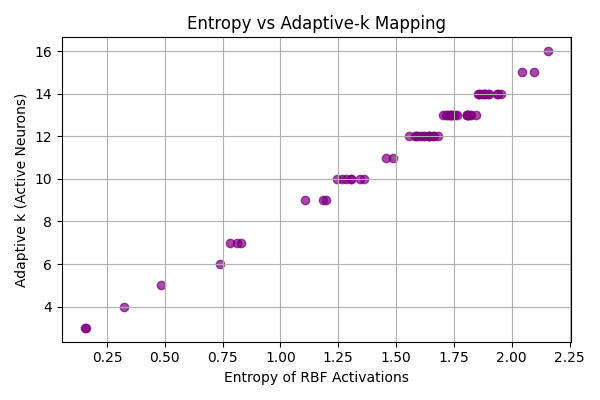
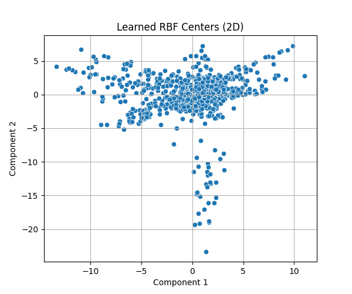
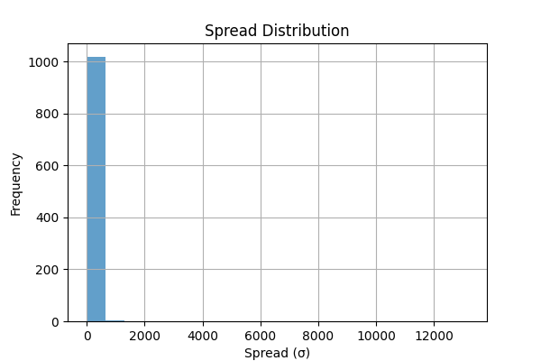
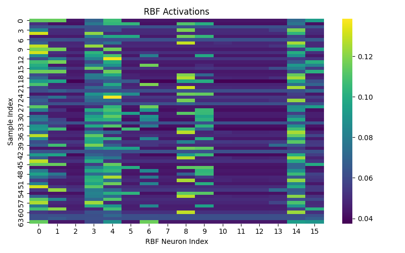

# Meta-RBFNet++

**Meta-RBFNet++** is a novel, CPU-efficient neural architecture that reimagines classical Radial Basis Function (RBF) networks through the lens of modern deep learning. It combines:
- Meta-learning of basis functions (μ and σ)
- Entropy-aware adaptive sparsity
- Attention-based output aggregation

This implementation is completely built in PyTorch and requires no GPU to run.

---

## Key Features

- **Meta-Learned RBF Kernels**  
  RBF centers (μ) and spreads (σ) are learned per-input using a hypernetwork, allowing dynamic adaptation to local input structure.

- **Entropy-Gated Adaptive-k Activation**  
  Activations are selectively gated based on entropy, allowing the network to use fewer RBF units for confident inputs and more for ambiguous ones.

- **Attention-Based Aggregation**  
  Outputs are computed as a soft attention-weighted combination of learned value vectors, replacing the dense classifier layer for smoother gradients and better interpretability.

- **Fully Interpretable**  
  Visualizations of entropy, spreads, and attention maps provide insight into network behavior per input.

---

## Results and Visualizations

| Description | Preview |
|------------|---------|
| **Entropy vs Adaptive-k** |  |
| **Learned RBF Centers (2D PCA)** |  |
| **Spread Distribution (σ)** |  |
| **RBF Activations Heatmap** |  |

---

## Installation

```
git clone https://github.com/yourusername/Meta-RBFNet-PlusPlus.git
cd Meta-RBFNet-PlusPlus
pip install -r requirements.txt
```
---

## Running the Model

```
python train.py
```

This will:
- Train the network on the `digits` dataset from `sklearn`
- Save loss values
- Output 4 key visualization plots to the `results/` folder

---

## Project Structure

```
Meta-RBFNet-PlusPlus/
├── model.py           # MetaRBFNet++ model
├── train.py           # Training and testing loop
├── utils.py           # Entropy gating and helpers
├── visualize.py       # PCA, entropy plots, heatmaps
├── requirements.txt   # Dependencies
├── LICENSE            # MIT License
├── README.md
└── results/           # Auto-saved output graphs
```
---

## Citation (Preprint Coming Soon)

If you use this work in academic research, please cite the upcoming paper:
```
@misc{meta_rbfnet2025,
  title={Meta-RBFNet++: An Adaptive, Entropy-Aware, Attention-Augmented Radial Basis Function Network},
  author={Siddhartha Mahesha Pundit},
  year={2025},
  note={Preprint},
  url={https://github.com/SiddharthaStoic/Meta-RBFNet-PlusPlus}
}
```
---

## License

MIT © 2025 [Siddhartha Mahesha Pundit](https://github.com/SiddharthaStoic)